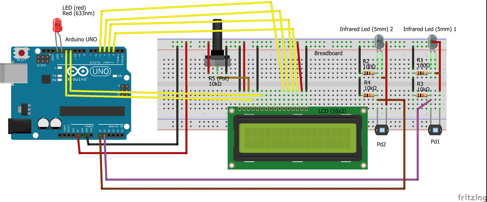

## Object-Speed-Checker
Object Speed Checker is an electronics project implemented on Arduino UNO Board.

**Object Speed Checker is a device that calculates speed of an Object and displays it on LCD display.**

### Components Used
| ITEM	                                      | NEEDED |
|---------------------------------------------|:------:|
|Arduino Uno (Rev3)                           |1|
|LCD (compatible with Hitachi HD44780 driver)	|1|
|Red LED (633nm)	                            |1|
|Infrared LED (5mm)                           |2|
|Photodiode (IR light Phototransistor)        |2|
|100Ω Resistor	                              |2|
|10kΩ Resistor	                              |2|
|10kΩ Potentiometer    	                      |1|
|5 volt Battery                               |1|

### Description
The purpose of doing this project is to develop a speed checker for highways and to alert the traffic authorities in case of any speed violation. Many lives are lost due to rash and rude driving on highways.  
This proposed project consists of a power-supply, Arduino UNO board, IR sensors, LED and Displays. The entire system gets its power from the power-supply and the Arduino Board as the major component of the whole systems.

  

IR sensors are placed on either sides of the road, for detecting the speed limit of the vehicle. The arduino is programmed using embedded C programming that calculates the time duration between two sensors, correspondingly gives the speed. If the speed limit exceeds then Red LED glows for a second as a sign of Overspeed and displays the information on the LCD Display.

### Schematic Diagram

### Arduino Code

Code for controlling IR sensors and displaying Speed on 16x2 LCD screen can be found [here](Object-Speed-Checker/Code/objectSpeedChecker.ino).
